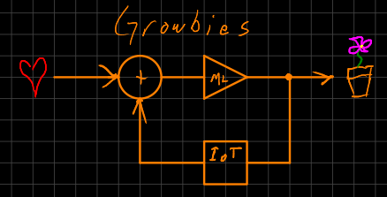

Summary
=======
A feedback-control, based on networks of things and machine learning, for agriculture.

In development. 



Credits
=======

- https://github.com/bogde/HX711/

Python Virtual Environment
==========================
Create a virtual environment with:

```
$ python3 -m venv <path_to_venv>
```

Activate the virtual environment with:

```
$ source <path_to_venv>/bin/activate
```

There are required and optional dependencies. To install all required and optional dependencies:
```
$ pip install -e .[ALL]
```

See [setup.cfg](setup.cfg) for other optional dependencies.

Other Setup
===========
Installing [platformio udev rules](https://docs.platformio.org/en/latest/core/installation/udev-rules.html) 
made the /dev/tty* devices accessible from within a rootless podman container.

To allow non-root access to the serial port, add the user to the `dialout` group. Be sure to 
logout/login for the changes to take effect.

Arduino Setup
=============
- Install [arduino-cli](https://arduino.github.io/arduino-cli/1.1/installation/)
- Install arduino uno board platform `./arduino-cli core install arduino:avr`

Arg Complete Setup (Optional)
=============================
Growbies supports CLI tab completion via the pip package `argcomplete`. To install and configure:

- `sudo pip install argcomplete`
- `sudo activate-global-python-argcomplete`
- `echo 'eval "$(register-python-argcomplete growbies)"' >> ~/.bashrc`
- `source ~/.bashrc`

Add User to growbies group
==========================
A `growbies` group is created at package installation time. This group can access the `growbies` 
systemd service. Add your user to this group to gain access to the client:

- `sudo usermod -aG growbies <username>`
- Logout and back in.

Notes
=====
- There is a bug with matplotlib and python 3.14. 
  - https://github.com/matplotlib/matplotlib/issues/29185
  - fix at https://github.com/tacaswell/matplotlib/commit/60903f0b0cf6b50b2fdc84ce205b9d6cb9f65de7
    - thank you
