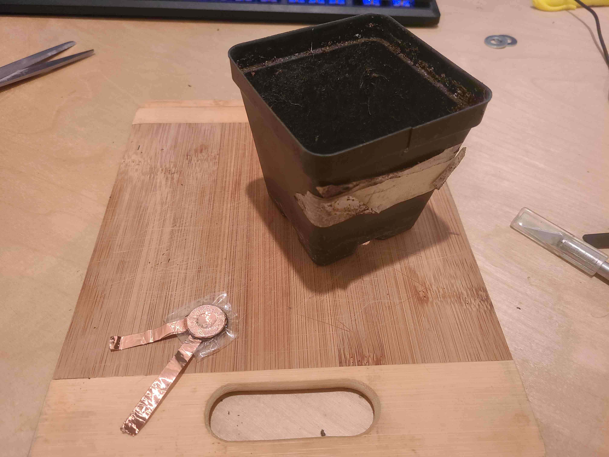
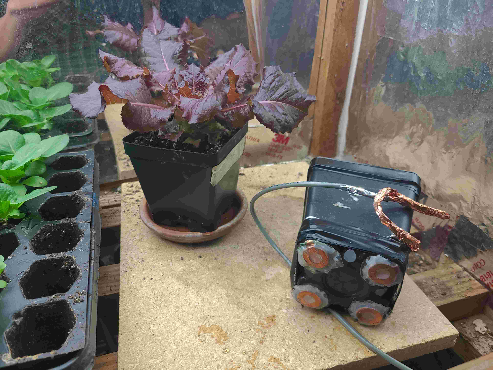
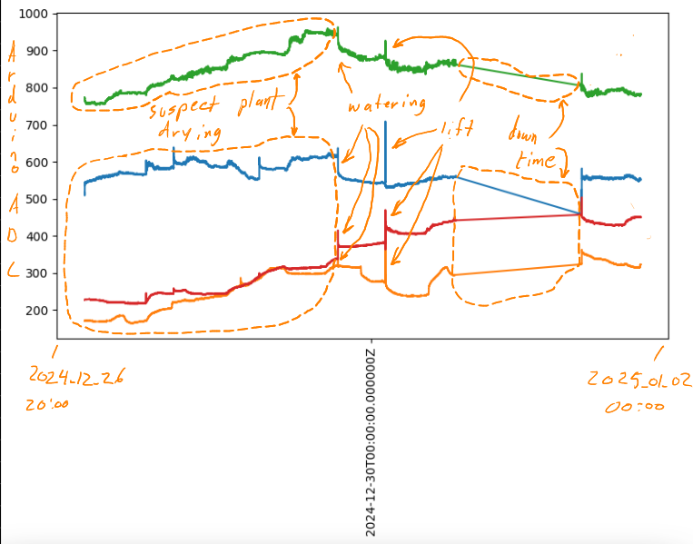
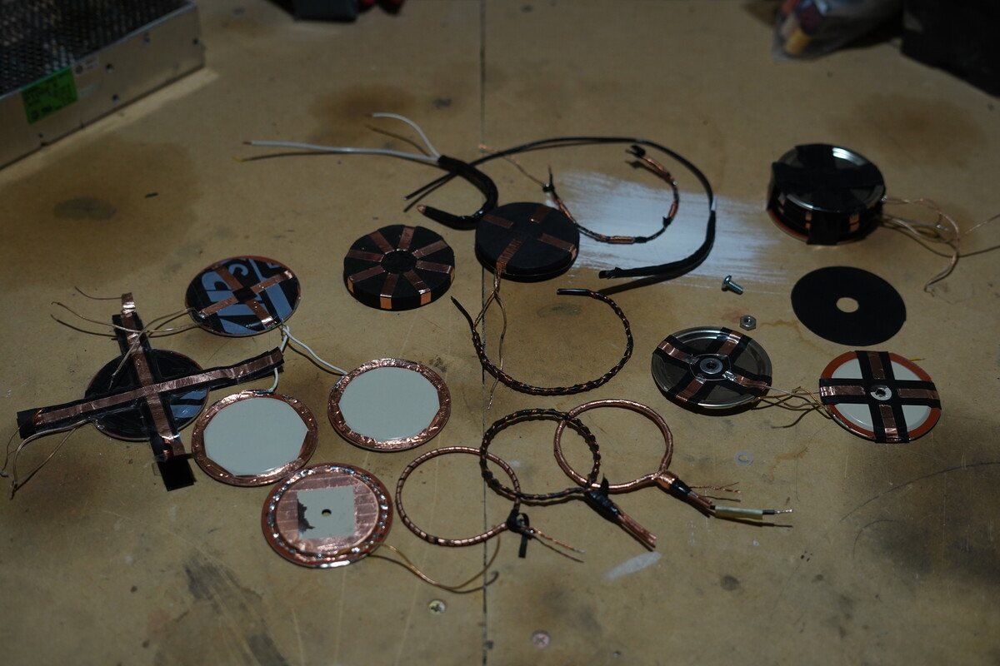
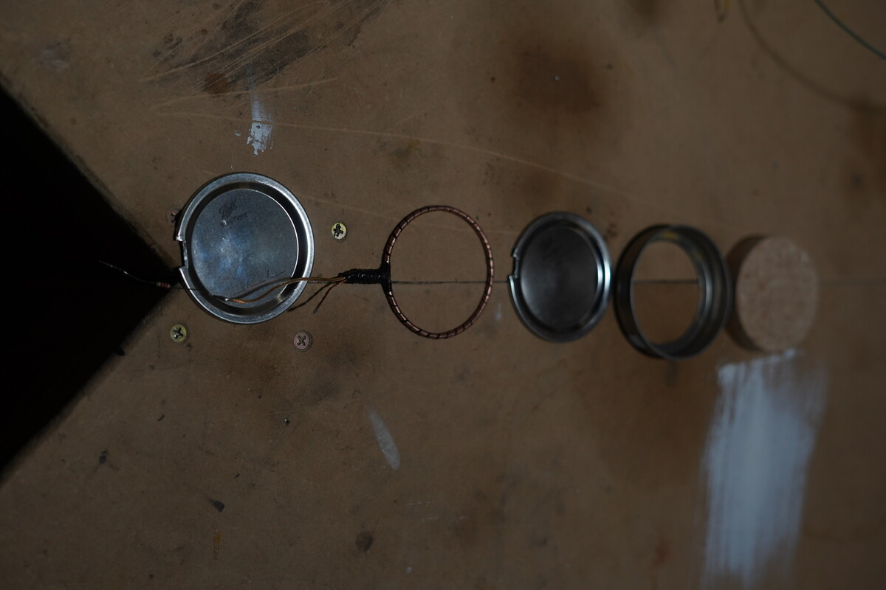
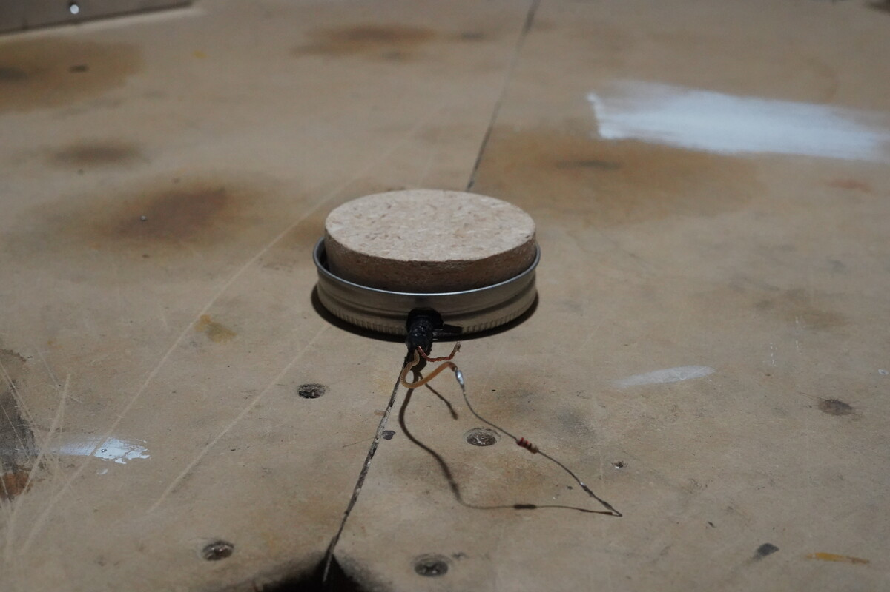
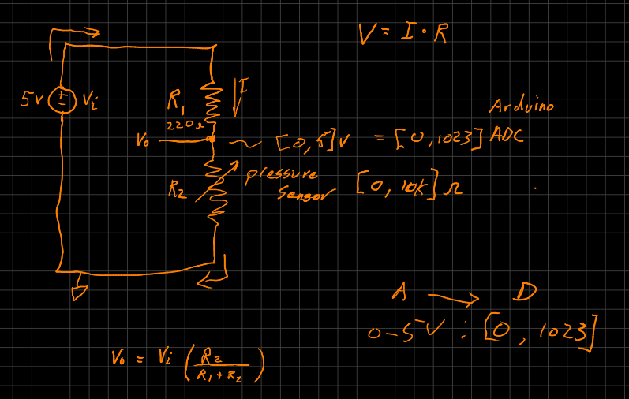

Velostat Pressure Sensing Investigation
=======================================

In late 2024, into early 2025, an investigation was made into the possibility of using velostat
as a means for cost effective load sensing.

The resistance of velostat changes with pressure. When sandwiched between conductive material, it
can be used as a pressure sensor.

Here is a load cell built from copper tape, washers and velostat. It is then sealed with packing
tape:

          packing tape.

These were glued to the bottom of a gardening cup. The purple lettuce plant was then placed into
the cup.

          will go into the cup is also shown.

Data was collected via Arduino.

Other sensors were investigated.

This one is 12 gauge copper wire, wrapped in two layers of velostat strips. The velostat layers are
wrapped in a copper strip layer. This copper velostat ring sandwich is compressed between two
regular mouth canning lids in a canning ring. The sandwich is then compressed with a disc of
particle board. There is a 220 ohm resistor in line.

Expanded form:

Assembled form:

The above velostate ring sensor was placed on a kitchen scale. 5 volts was applied to the following
resistor divider.

A photographic time lapse was taken of 1. the kitchen scale display and 2. a voltmeter displaying
Vo in the circuit above, using the above velostat ring sensor.

The data was read from the pictures via a trained
`Tesseract <https://github.com/tesseract-ocr/tesseract>`_ models.

    - `mm.traineddata <https://github.com/highvelcty/growbies/blob/main/tesseract/mm.traineddata>`_
      # For reading the multi-meter (voltmeter) display.
    - `scale.traineddata <https://github.com/highvelcty/growbies/blob/main/tesseract/scale.traineddata>`_
      # For reading the kitchen scale output

